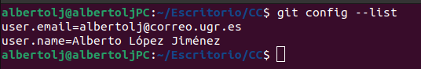
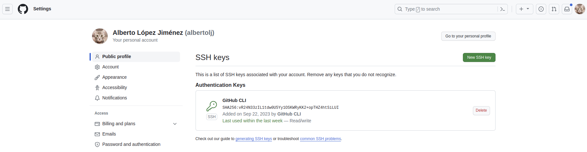
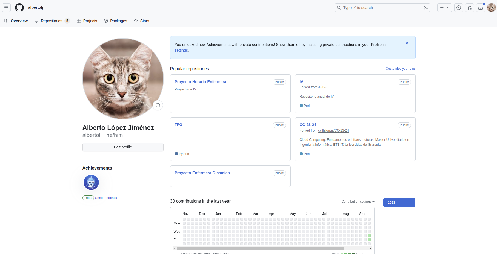

# Hito 1

## Configuración de git y GitHub

### Autenticación en dos pasos

Aquí se muestra que se ha configurado correctamente la autenticación en dos pasos.

### Nombre y correo correctos en los commits

Se ha configurado correctamente el nombre y correo para la realización de los commits.

### Clave SSH subida a GitHub

Como ya se ha configurado previamente la clave SSH para acceder a GitHub, a continuación se muestra la clave ya subido en la plataforma.

### Perfil de la cuenta de GitHub

Para la configuración del perfil de GitHub, se ha creado un perfil que dispone de una imagen distintiva y completar la hoja de datos personales.

