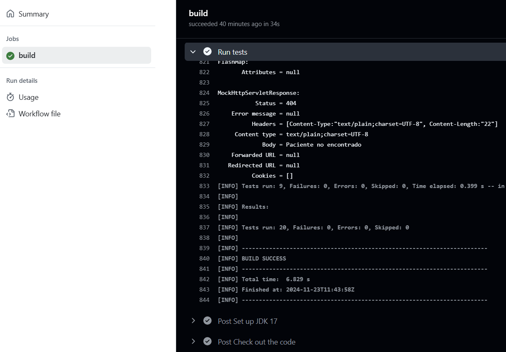

## Integración Continua

La **Integración Continua (CI)** se ha configurado correctamente mediante el uso de **GitHub Actions**. Cada vez que se realiza un **push** al repositorio, los **tests automatizados** se ejecutan en un entorno controlado para asegurar que todo el código nuevo o modificado no introduce fallos en el sistema.

El archivo de configuración de **GitHub Actions** se encuentra en el directorio `.github/workflows`, donde se define el flujo de trabajo para la ejecución de los tests. Este flujo de trabajo incluye la instalación de dependencias, la ejecución de las pruebas con Maven y la validación de los resultados.

En la siguiente imagen, se muestra la interfaz de **GitHub Actions**, donde se puede ver que todos los tests se han ejecutado correctamente:

Se ha elegido este sistema por ser gratuito, respecto de otros sistemas como Jenkins.

## Pruebas de Lógica de Negocio

Para probar la lógica de negocio de la aplicación, se ha implementado un conjunto de pruebas unitarias e integradas utilizando **MockMvc** para simular las peticiones HTTP a los controladores y validar las respuestas. 

Un ejemplo de esta implementación es la prueba **`testAddPacienteToMedico_Success()`**, que valida el comportamiento de la lógica de negocio al intentar agregar un paciente a un médico. Esta prueba asegura que cuando se realiza una solicitud para asociar un paciente con un médico, el sistema responde correctamente con el médico actualizado, que incluye al paciente en su lista de pacientes.