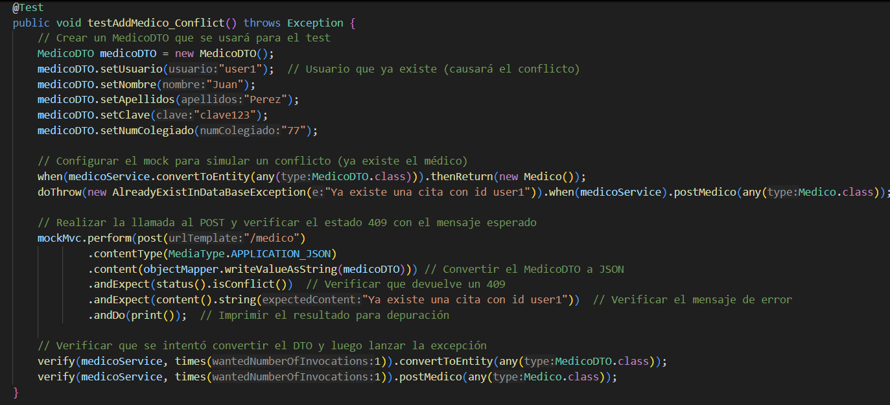
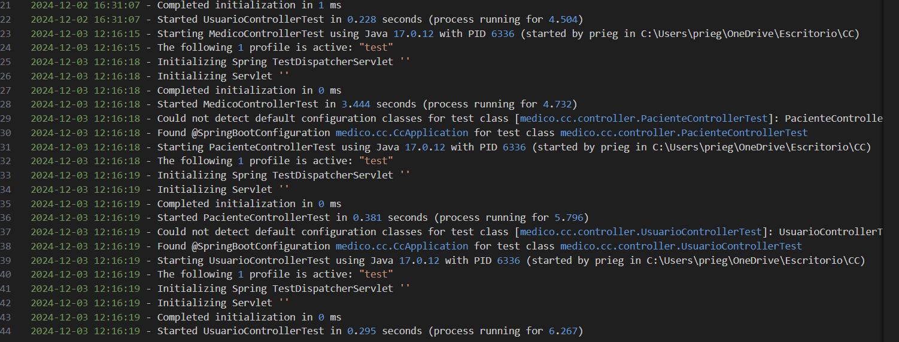
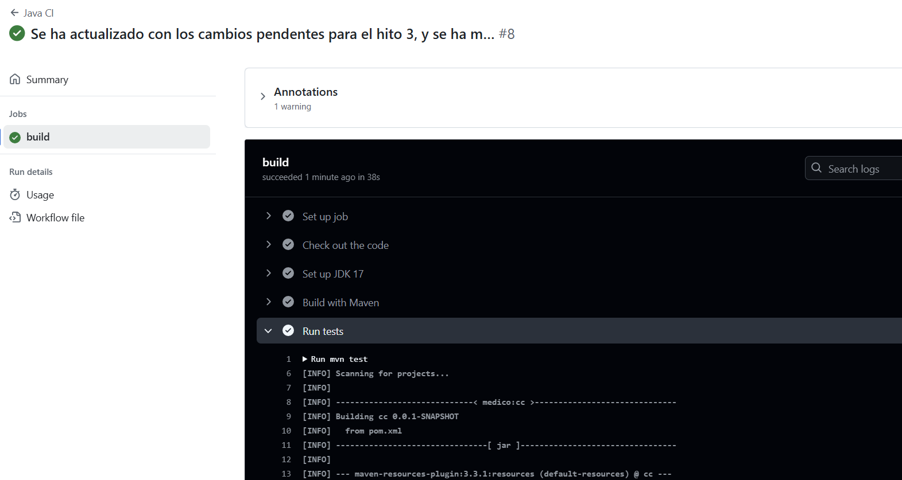

# Hito 3

## 1. Justificación técnica del framework elegido para el microservicio

Se eligió **Spring Boot** como framework principal para el desarrollo del microservicio debido a las siguientes razones:

- **Simplicidad y rapidez**: Spring Boot permite configurar aplicaciones de manera sencilla.
- **Desarrollo modular**: Facilita la creación de aplicaciones organizadas por capas (controladores, servicios, repositorios), promoviendo el desacoplamiento de la lógica de negocio.
- **Conocimiento previo**: Se ha trabajo previamente con dicho framework, por lo que la integración ha resultado más sencilla.

## 2. Diseño general de la API, rutas, tests y documentación

El proyecto sigue una arquitectura en capas, dividiendo las responsabilidades de manera clara:

- **Controladores**: son (`MedicoController`, `PacienteController`, `UsuarioController`). Gestionan las solicitudes HTTP y las delegan a la capa de servicios.
- **Servicios**: son (`MedicoService`, `PacienteService`, `UsuarioService`): Contienen la lógica de negocio.
- **Repositorios**: Se encargan de interactuar con la base de datos.
- **Entidades**: Se encarga de definir las tablas.
- **DTO**: Son los objetos con los que interactúa la capa controlador.

Cada controlador está anotado con `@RestController` y tiene una ruta base definida con `@RequestMapping`, siguiendo esta estructura:

- **Rutas principales**:
  - `/medico`: Operaciones relacionadas con médicos.
  - `/paciente`: Operaciones relacionadas con pacientes.
  - `/usuario`: Operaciones relacionadas con usuarios. En este caso en específico, no se ha utilizado la anotación `@RequestMapping`, pero todas las peticiones corresponden con el `/usuario`.

En este apartado, se va a explicar las rutas y tests del archivo MedicoController. Sus rutas, teniendo en cuenta empiezan por `/medico` son las siguiente:

- **@GetMapping("/all")**: devuelve todos los objetos medico.
- **@GetMapping("/{medico_id}")**: devuelve el objeto medico que tenga como id {medico_id}.
- **@PostMapping**: en la ruta /medico, pasándole como JSON un objeto MedicoDTO, guarda el objeto en la clase medico y devuelve el objeto creado.
- **@PutMapping**: en la ruta /medico, pasándole como JSON un objeto MedicoDTO, busca el objeto en la clase medico que tenga el mismo id, lo edita y devuelve el objeto creado.
- **@PatchMapping**: lo mismo que la ruta anterior, pero solo actualizando los campos que se hayan pasado y no todos.
- **@PatchMapping("/{medico_id}/paciente/{paciente_id}")**: añade el paciente que tenga id {paciente_id}, al médico que tenga id {medico_id}.
- **@DeleteMapping("/{id}")**: borra el medico con id {id}.
- **@DeleteMapping("/{medico_id}/paciente/{paciente_id}")**: borra el paciente con id {paciente_id} del médico con id {medico_id}.

En el caso del PacienteController, tiene las misma rutas, y en el caso de UsuarioController, sus rutas son contenidas por las rutas explicadas anteriormente.

A continuación, se explican los tests de MedicoControllerTest:

-  **public void testGetMedicos()**: verifica que el servicio ``/medico/all`` fue llamado correctamente.
- **public void testGetMedicoById_NotFound()**: verifica que el servicio ``/medico/{medico_id}`` fue llamado sin existir un medico y retorna el error esperado.
- **public void testAddMedico_Conflict()**: verifica que si se realiza una petición POST existiendo dicho usuario, deuvelve el error esperado.
- **public void testAddMedico_Success()**: igual que el test anterior, pero esta vez, se ha realizado correctamente.
- **public void testAddPacienteToMedico_Success()**: el test más complejo en el que se verifica que cuando se realiza la peticion PATCH de guardar un paciente en un médico, se realice correctamente.
- **public void testAddPacienteToMedico_NotFound()**: igual que en el test anterior, pero devuelve un error ya que se busca que no exista el médico o paciente.
- **public void testRemovePacienteFromMedico_Success()**: verifica que se borra correctamente el paciente del médico sin eliminar otros datos.
- **public void testRemovePacienteFromMedico_NotFound()**: verifica que salte la excepción esperada al no encontrar el medico.

A continuación, se muestra un test de los descritos en el párrafo anterior.

## 3. Uso de Logs para Registrar la Actividad de la API

Para registrar la actividad de la API, se ha utilizado **Logback**, un framework utilizado en el ecosistema de Java. Las razones para su elección son las siguientes:

1. **Integración nativa con Spring Boot**: Logback está configurado de manera predeterminada en las aplicaciones Spring Boot, lo que facilita su uso y personalización.
2. **Alto rendimiento**: Ofrece un manejo eficiente de la escritura de logs, incluso en entornos de alta carga.
3. **Flexibilidad**: Permite definir configuraciones específicas para diferentes niveles de log (INFO, WARN, ERROR) y salidas de registro (archivos, consola, etc.). Además, con las etiquetas `<destination>`, permite enviar la información a un puerto, por lo que en el siguiente hito, se puede configurar para enviarlo a un contenedor logstash ubicado en el puerto 5044.

Su configuración se encuentra en el archivo `logback-spring.xml` y actualmente se guarda los logs en el archivos logs/app.log

## 4. Correcta ejecución de los tests

Se vuelve a comprobar que se ejecutan los tests corretcamente.

