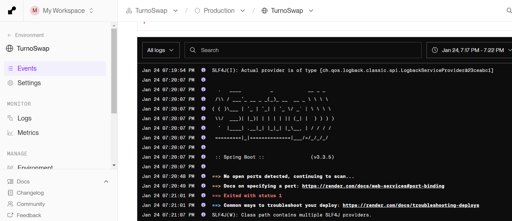

# Documentación de Despliegue en PaaS

## **1. Descripción y Justificación de los Criterios para Elegir el PaaS**

Para elegir el PaaS, se ha tenido en consideración que la información se almacene en Europa, que no tenga ningún coste e implementación automática con GitHub.
Se ha tenido en cuenta los siguientes PaaS: Google Cloud Run (hay una prueba gratuita de 300€), Render y Fly.io

Como elección, de primeras se ha implementado en Google Cloud Run ya que puede tener mayor valor de cara al mercado laboral (aunque también se ha intentado implementar en Render y Fly.io)

## **2. Descripción y Justificación de las herramientas para desplegar el PaaS**

### Google Cloud Run

Para realizar el despliegue en Google Cloud Run, desde su interfaz web se ha creado una base de datos SQL y configurada para su conexión como se muestra en la siguiente imagen.

A continuación, desde el Google Clous Run se ha configurado la implementación del contenedor de la aplicación.

Por último, se muestra la configuración de implementación continua.

Con esta configuración, se ha intentado realizar el despliegue pero hubo un problema con el despliegue. Según los logs, fallaba en el proceso del despliegue ya que no detectaba el puerto de la app, aunque en la configuración inicial se ha especificado. El error es el siguiente:

Los beneficios de la herramienta utilizada es su fácil implementación y lo competitivo que se encuentra en el mercado, pudiendo especificar de forma sencilla tanto la conexión con github como la implementación de las variables de entorno.

### Render

Siguiendo la misma lógica que en Google Cloud Run, se creo una BBDD SQL y la app a la que conectarla.

A continuación, se muestra las variable de entorno. Los valores de la BBDD son los dados por la conexión creada en Render previamente.

Otras de los beneficios de Render, igual que en Google Cloud Run, es que se puede configurar de forma sencilla la conexión con GitHub.

Por último, se muestra el log del error al desplegar, que al contrario que Google Cloud Run es poco descriptivo.

### Aplication properties y dockerfile

Se ha adaptado el aplication.properties y dockerfile para que funcione con variables de entorno. Además, se ha cambiado el dockerfile completamente para que compile el proyecto maven directamente.

## Despliegue automático al PaaS desde GitHub

Para realizar el despliegue automáticamente, aunque en el punto anterior he explicado que en distintos PaaS se puede hacer directamente desde la interfaz, se ha creado un archivo deploy.yml de forma teórica.
La idea para realizar el despligue de forma automática es que cuando detecte un push o pull request, compruebe el código, se autentique en el PaaS, se construye la imagen del docker y se despliega.